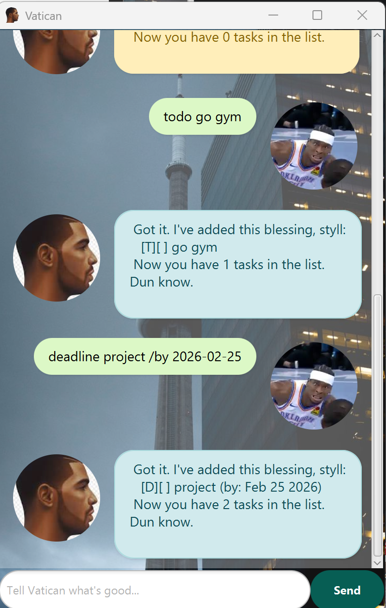

# 🦉 Vatican // The 6ix Side Assistant User Guide

Vatican is a desktop task management application optimized for use via a Command Line Interface (CLI) but wrapped in a modern, reactive **JavaFX GUI**.

It features a unique **Toronto wasteyute persona** that manages your productivity. It roasts you for errors and blesses you for productivity.

---

## 📸 Product Screenshot

---

## 🚀 Features

Vatican uses **Type-Safe Contextual Styling**, changing the interface color dynamically based on the command type:

* 🔵 **Blue**: Adding new missions (`todo`, `deadline`, `event`).
* 🟢 **Green**: Successfully `mark`-ing a mission.
* 🟠 **Orange**: Clearing `delete` wasteyutes or saying `bye`.
* 🔴 **Red**: When you're moving loose (errors).

---

## 🛠 Usage

### `todo`: Add a simple mission
Adds a task without any date/time constraints.
* **Format:** `todo DESCRIPTION`
* **Example:** `todo go gym`

### `deadline`: Add a mission with a cutoff
Adds a task that needs to be done by a specific date.
* **Format:** `deadline DESCRIPTION /by DATE`
* **Example:** `deadline cs2103 project /by 2026-02-25`

### `event`: Add a timed link-up
Adds a task with a start and end time.
* **Format:** `event DESCRIPTION /from START /to END`
* **Example:** `event project meeting /from 2pm /to 4pm`

### `list`: See all your current blessings
Displays every task currently in your database.
* **Format:** `list`

### `mark` / `unmark`: Update mission status
Check off a task or re-open it if it's not finished.
* **Format:** `mark INDEX` or `unmark INDEX`
* **Example:** `mark 1`

### `delete`: Clear a wasteyute
Removes a task from your list permanently.
* **Format:** `delete INDEX`
* **Example:** `delete 2`

### `find`: Search for specific business
Finds tasks containing a specific keyword.
* **Format:** `find KEYWORD`
* **Example:** `find gym`

### `help`: Open the guide
Displays the help menu with all available commands.
* **Format:** `help`

### `bye`: Peace out
Closes the application.
* **Format:** `bye`

---

## ❓ FAQ

**Q**: How do I save my data?  
**A**: Vatican saves your blessings automatically every time you add, delete, or mark a task. Don't sweat it.

**Q**: Where is my data stored?  
**A**: It's kept in a local file at `./data/vatican.txt`.

---

> [!IMPORTANT]
> Ensure dates for deadlines follow a recognizable format (e.g., YYYY-MM-DD) for the best experience.